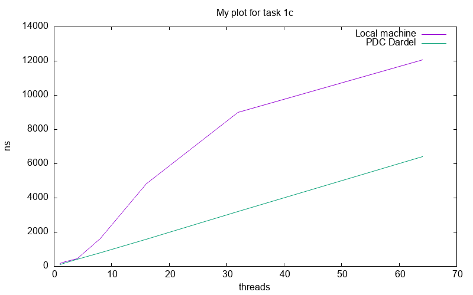
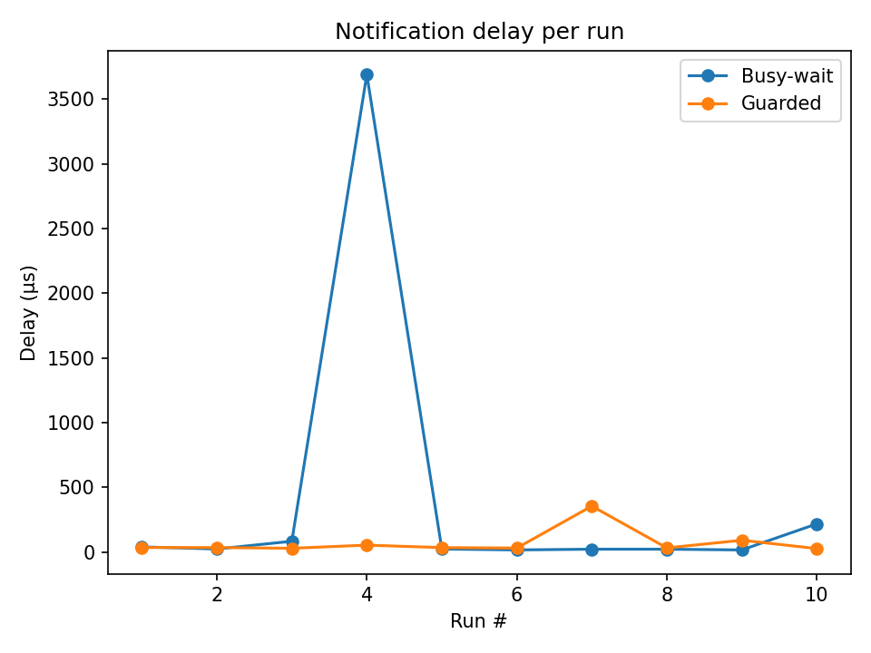

# Lab 1 - Basic Concurrency in Java

- Lab Group x&zx
- Xin Li and Zixiang Hong

## Task 1: Simple Synchronization

### Task 1a: Race conditions

Source files:

- `task1/MainA.java` (main file)

To compile and execute:
```
javac MainA.java
java MainA
```

I expected the value to be 1,000,000 * 4=4,000,000
But because of race conditions, some writes of some threads are lost, so usually it will be less than 4,000,000
Program output:
```
(base) xinl4@login1:~/lab1/task1> java A
Final counter value: 1272257
Expected value: 4000000
```


### Task 1b: Synchronized keyword
Source files:

- `task1/MainB.java` (main file)

To compile and execute:
```
javac B.java
java B
```

When using the synchronized keyword for incrementing the shared integer, every operation is atomic, so we should be able to get the correct result 4000000.
```
Final counter value: 4000000
Expected value: 4000000
Elapsed time (ns): 426465242
```

### Task 1c: Synchronization performance

Source files:

- `task1/MainC.java` (main file)

To compile and execute:
```
javac C.java
sbatch submit.sh
```

In figure 1, we see how the execution time scaled with the number of threads.
...



## Task 2: Guarded blocks using wait()/notify()
### Task 2.a

Source file:

- `task2/MainA.java`

To compile and execute:
```
javac MainA.java
java MainA
```
Result: outputs are non-deterministic (often intermediate values) due to a race condition and missing happens-before ordering.
```
Current value of sharedInt: 23858
```

### Task 2.b

Source file:

- `task2/MainB.java`

To compile and execute:
```
javac MainB.java
java MainB
```
Result: `done` signals completion to the printer, the output is correct.
```
Current value of sharedIntB: 1000000
```

### Task 2.c


Source file:

- `task2/MainC.java`

To compile and execute:
```
javac MainC.java
java MainC
```
Result: Using a guarded block, the printer waits for the `done` condition and deterministically prints the final value of `sharedInt`.
```
Current value of sharedIntC: 1000000
```

#### Task 2.d
Add the printing code
```
static volatile long tDone, tSeen;
tDone = System.nanoTime();
tSeen = System.nanoTime();
System.out.println("B: delay_ns=" + (tSeen - tDone));
```
- `task2/task2D.sh` (bash file)
- `task2/plot.py` (plot code)

Result: 
Busy-wait yields lower typical latency but exhibits large outliers, indicating poor tail latency and sensitivity to preemption.
Guarded has a slightly higher median delay yet is markedly more stable, making it preferable when predictable latency and low CPU usage matter.



## Task 3: Producer-Consumer Buffer using Condition Variables

### Task 3.a

The order is FIFO. I used a LinkedList to mimic the behavior of a queue, and variable capacity to control the capacity of the queue. When a thread calls the function add, it will awake notEmpty. When a thread calls the function remove, it will awake notFull. And when the function close is called, both notEmpty and notFull will be awakened and the await threads can continue to execute.

Source files:

- `task3/Task3.java` (main file)

### Task 3.b

The result is:
```
1
…
1000000
Consumer: Buffer is closed and empty.
All done!
```
Because thread 1 will add 1-1,000,000 to the buffer and then close the buffer, and thread 2 will read these integers in an FIFO manner. After reading 1-1,000,000, thread 2 catches an exception and gracefully terminates.


## Task 4: Counting Semaphore

Source files:

- `task4/Task4.java` (main file)

In `signal()`, I increased the value in the synchronized statement and set the thread.granted to true.

In `s_wait()`, I decreased the value in the synchronized statement and wait the current thread. In the while loop, I set the condition to `currentThread.granted` to prevent from spurious wakeups. Therefore, if one thread waked up unintentionally, its variable granted is still false and will be trapped in the while loop, and then it will go to wait state again.

No special interesting bugs found during testing.

I tested the following scenarios:

- 10 threads, semaphore with value=3, I checked the maximum number of active concurrent threads. It's always less or equal thant 3
- semaphore with value = 1. I let one thread call s_wait() and enter the critical section. At the same time, I let another thread called s_wait() to see if it will be blocked.

All these test scenarios passed successfully

```
test: capacity=3 threads=10 iters=500maxActive=3, violation=false, ticurrentThread=1846ms
OK!
simple test
[holdThread] acquired semaphore, holding...
[waitThread] trying to acquire semaphore...
[main] waitThread state: WAITING
[holdThread] released semaphore
[waitThread] acquired semaphore!
[main] test finished.
All tests finished.
```

## Task 5: Dining Philosophers
### Task 5.a

Source file:

- `task5/MainA.java`

Result: Deadlock detected!
```
P0: Picked Left
P4: Picked Left
P3: Picked Left
P1: Picked Left
P2: Picked Left
P0 state = BLOCKED
P1 state = BLOCKED
P2 state = BLOCKED
P3 state = BLOCKED
P4 state = BLOCKED
>>> Deadlock detected (all philosophers are BLOCKED waiting for the right chopstick).
```

Then compare the deadlock time for different `N`
```
N = 5
Deadlock time for 5 philosophers: 3.030079135 seconds

N = 10
Deadlock time for 10 philosophers: 3.027682719 seconds

N = 50
Deadlock time for 50 philosophers: 3.042731987 seconds

N = 500
Deadlock time for 500 philosophers: 8.344318485 seconds
```
The deadlock time is stable for smaller philosopher counts but increases significantly with larger numbers, like N=500, due to higher competition for shared resources.

### Task 5.b

`jstack`. It can be used to analyze blocked threads and provides detailed information about where and why the deadlock occurs.

### Task 5.c

Source file:

- `task5/MainB.java`

Result: Deadlock detected!
```
P1: Picked Left
P4: Picked Right
P2: Picked Right
P1: Picked Right, eating
P4: Picked Left, eating
P1: Put Right
P1: Put Left
P2: Picked Left, eating
P4: Put Left
P0: Picked Right
P4: Put Right
P0: Picked Left, eating
P2: Put Left
P2: Put Right
P3: Picked Left
P0: Put Left
P0: Put Right
P3: Picked Right, eating
P3: Put Right
P3: Put Left
P0 state = TERMINATED
P1 state = TERMINATED
P2 state = TERMINATED
P3 state = TERMINATED
P4 state = TERMINATED
>>> No full deadlock observed in this run (try again, or add a loop to increase chance).
```
##### Deadlock free:
By alternating the order in which philosophers pick up the chopsticks, the solution avoid the situation where all philosophers are holding one chopstick and waiting for the other, which would result in a deadlock.

##### Starvation free:
Every philosopher gets a chance to eat, as the even and odd IDs alternate. This ensures that no philosopher has to wait indefinitely for access to both chopsticks.

