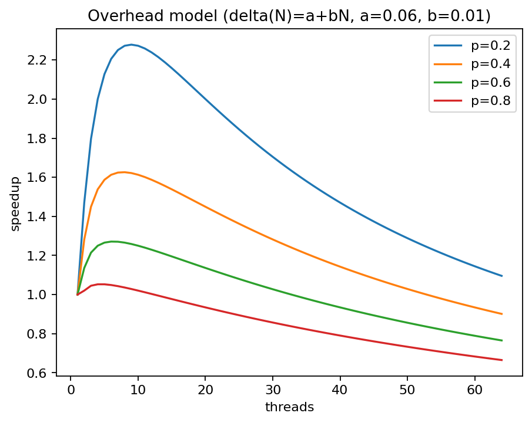
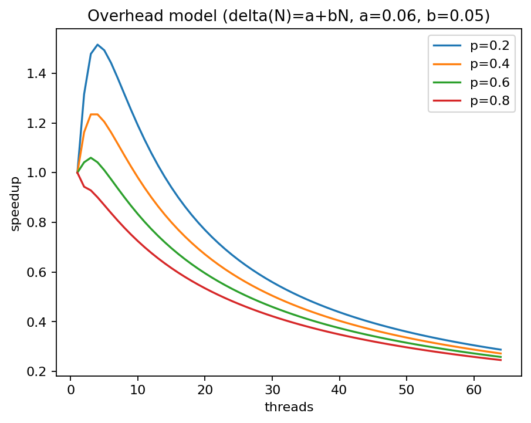

# Lab 2 - Java Parallel Programming and Sorting Algorithms
- Group x&zx
- Li, Xin and Hong, Zixiang

## Task 1: Sequential Sort
We chose to implement MergeSort

Source files:

- `SequentialSort.java`

## Task 2: Amdahl's Law

Classical Amdahl's law:

$$
S(N)=\frac{1}{(1-p)+\frac{p}{N}}.
$$

Here is a plot of our version of Amdahl's law 


We see that when $threads<15$, the speedup increases sharply; beyond that point, adding more threads brings negligible returns.

- As the thread count $N$ grows, recursion produces smaller subproblems.
- As thread increases, task scheduling, synchronization and cache effects cost more


### Our model: Amdahl + overhead

We add a linear overhead term to classical Amdahl’s law:
$$
S(N)=\frac{1}{(1-p)+\frac{p}{N}+\delta(N)}
$$

$$
\delta(N)=a+bN\quad (N>1),\qquad \delta(1)=0.
$$

Classical Amdahl assumes perfect division of work and negligible overhead, which overestimates speedup.  
By adding $\delta(N)$, we capture $N$-dependent costs (scheduling, synchronization, cache effects), so the curves visualized realistically as $N$ grows.





## Task 3: ExecutorServiceSort

Source files:

- `ExecutorServiceSort.java`

We implement a fixed thread pool with daemon workers to ensure the JVM exits cleanly after measurements, stop parallel recursion when either the depth limit $d=\lfloor\log_2 Thread\rfloor$ is reached or the subarray size $\le$ `SEQ_CUTOFF`. This keeps the merge logic identical to the sequential version and prevents task explosion.

**Why `SEQ_CUTOFF = 65536`:** with $N=1{,}000{,}000$,
- $S_4 = N/2^4 = 62{,}500 \approx 65{,}536$ → for $T=16$ we still use the deepest layer.
- $S_5 = N/2^5 = 31{,}250 < 65{,}536$ → for $T\ge 32$ we stop one level earlier.

## Task 4: ForkJoinPoolSort

Source files:

- `ForkJoinPoolSort.java`

We decided to ...

## Task 5: ParallelStreamSort

Source files:

- `ParallelStreamSort.java`

We first use 
```
ForkJoinPool pool = new ForkJoinPool(threads);
```
to create a thread pool.


Then, we use `Arrays.stream` to have an stream object of the int array. We use `.parallel()` to have a parallel stream of the int array. We use `.sorted()` to sort the stream and use `.toArray()` to convert the result to array.

We use 
```
System.arraycopy(tempt, 0, arr, 0, arr.length);
```
to copy the tempt result to `arr`

## Task 6: Performance measurements with PDC

We decided to sort 10,000,000 integers ...


We see that ...
