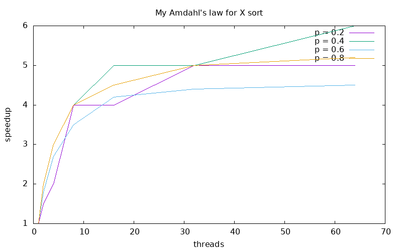
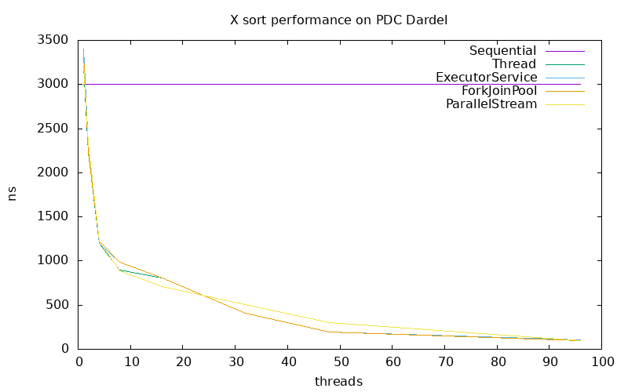

# Lab 2 - Java Parallel Programming and Sorting Algorithms
- Group 10
- Xin Li and Zixiang Hong

## Task 1: Sequential Sort
We chose to implement MergeSort

Source files:

- `SequentialSort.java`

## Task 2: Amdahl's Law

Our Amdahl's law ...

Here is a plot of our version of Amdahl's law ...



We see that ...

## Task 3: ExecutorServiceSort

Source files:

- `ExecutorServiceSort.java`

We decided to ...

## Task 4: ForkJoinPoolSort

Source files:

- `ForkJoinPoolSort.java`

We decided to ...

## Task 5: ParallelStreamSort

Source files:

- `ParallelStreamSort.java`

We first use 
```
ForkJoinPool pool = new ForkJoinPool(threads);
```
to create a thread pool.


Then, we use `Arrays.stream` to have an stream object of the int array. We use `.parallel()` to have a parallel stream of the int array. We use `.sorted()` to sort the stream and use `.toArray()` to convert the result to array.

We use 
```
System.arraycopy(tempt, 0, arr, 0, arr.length);
```
to copy the tempt result to `arr`

## Task 6: Performance measurements with PDC

We decided to sort 10,000,000 integers ...



We see that ...
