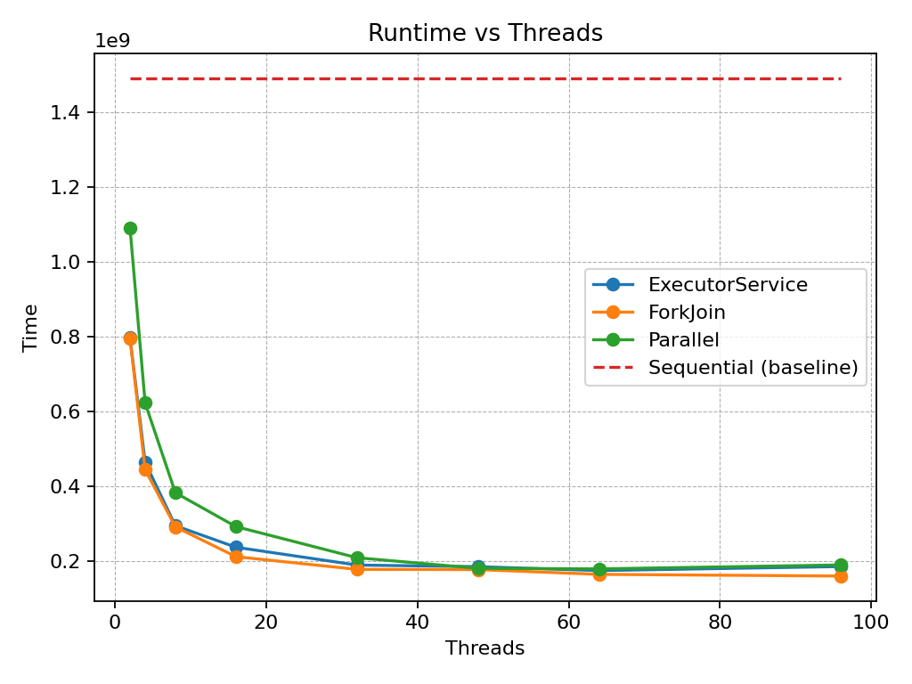
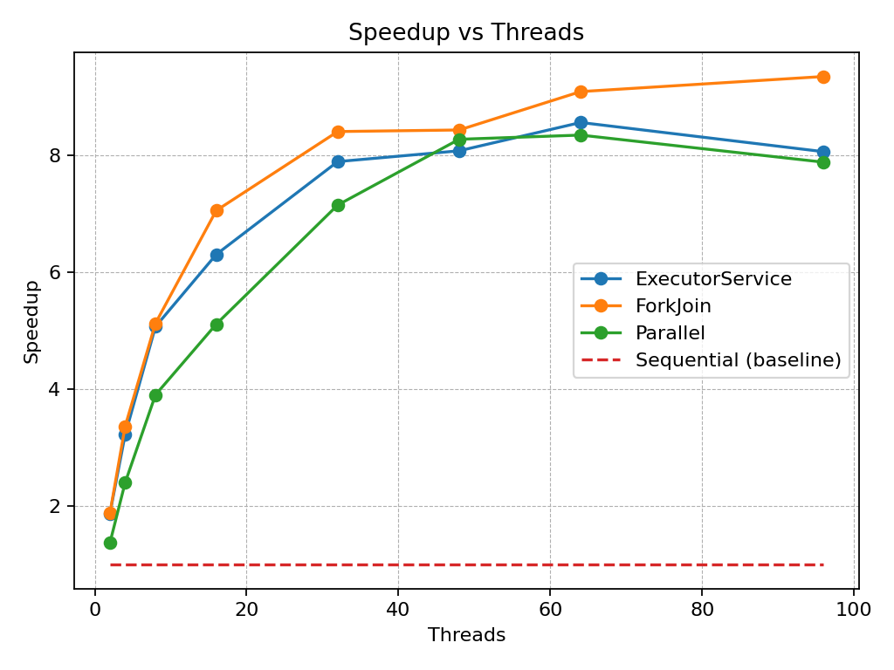

# Lab 2 - Java Parallel Programming and Sorting Algorithms
- Group x&zx
- Li, Xin and Hong, Zixiang

## Changes & Results (version 2)
1. Optimized `SequentialSort` to allocate one auxiliary array once and pass it through recursion; applied the same fix to `ExecutorServiceSort` and `ForkJoinPoolSort`. Result: fewer allocations/GC.
2. Redesigned `ParallelStream` to use lambda-based tasks with one reused buffer.
3. Reran all experiments with array size 10,000,000; achieved target speedups (~5–10×) without >25% degradation beyond 32 threads.

## Task 1: Sequential Sort
We chose to implement MergeSort

Source files:

- `SequentialSort.java`

## Task 2: Amdahl's Law

Classical Amdahl's law:

$$
S(N)=\frac{1}{(1-p)+\frac{p}{N}}.
$$

Here is a plot of our version of Amdahl's law 

We see that when $threads<15$, the speedup increases sharply; beyond that point, adding more threads brings negligible returns.

- As the thread count $N$ grows, recursion produces smaller subproblems.
- As thread increases, task scheduling, synchronization and cache effects cost more

### Our model: Amdahl + overhead

We add a linear overhead term to classical Amdahl’s law:

$$
S(N)=\frac{1}{(1-p)+\frac{p}{N}+\delta(N)}
$$

$$
\delta(N)=a+bN\quad (N>1),\qquad \delta(1)=0.
$$

Classical Amdahl assumes perfect division of work and negligible overhead, which overestimates speedup.  
By adding $\delta(N)$, we capture $N$-dependent costs (scheduling, synchronization, cache effects), so the curves visualized realistically as $N$ grows.

## Task 3: ExecutorServiceSort

Source files:

- `ExecutorServiceSort.java`

We implement a fixed thread pool with daemon workers to ensure the JVM exits cleanly after measurements.

## Task 4: ForkJoinPoolSort

Source files:

- `ForkJoinPoolSort.java`

We implement a parallel merge sort with a `ForkJoinPool` per subrange. Each task splits at the midpoint, runs both halves in parallel via `invokeAll`, and merges in the parent thread after the joins.

## Task 5: ParallelStreamSort

Source files:

- `ParallelStreamSort.java`

ParallelStreamSort implements a parallel mergesort using Java’s parallel streams, executed inside a custom ForkJoinPool to control the thread count.

## Task 6: Performance measurements with PDC
Out parameters:
- `SIZE=10000000`
- `WARMUP=10`
- `MEASURE=10`
- `SEED=42`

#### Are the performance gains/drops between different numbers of threads what you expected?
Yes. Speed improves from 2→8–16 threads, then flattens as thread-management and memory overheads dominate.

#### What implementation ran the fastest/slowest? Was this in accordance with your expectations?
Fastest is `ParallelStream`; slowest is `Sequential`. ExecutorService and ForkJoin are close, which is expected since they share the same merge and depth cap and pay extra scheduling overhead compared to `ParallelStream`.

#### What method was the easiest to implement?
`ParallelStream`, no manual recursion, merge code, or tuning; just a one-line parallel stream.

#### What method do you prefer?
`ParallelStream`, because it is easy and performs best.
