# Lab 3 - Validating Linearizability of Lock-free Skiplists

- Group x&zx
- Li, Xin and Hong, Zixiang

# 1. Measuring execution time

## 1.1 Measurement program
Source files: 
- `task1.1.sh`
- `plot1.py`


## 1.2 PDC experiments
Source files: 
- `task1.2.sh`
- `plot1.py`


### Observation
- For write-heavy mixes, B.2 < A.2, with the gap widening as threads increase.
- For read-heavy mixes, on PDC B.1 < A.1, while locally A.1 ≲ B.1 at small thread counts and only crosses as threads grow.
- Within each distribution, A.1 < A.2 and B.1 < B.2 (read-heavy beats write-heavy).

### Possible explanations
1. Normal concentrates keys, reducing the effective set and shortening traversals for updates—hence B.2 faster despite some extra contention.
2. Normal improves cache locality but creates hot spots; on PDC locality dominates, while locally at low T hot-spot interference offsets it.
3. Read-heavy mixes avoid the level-0 CAS bottleneck and helping costs, so .1 is consistently faster than .2 for both distributions.

# 2. Identify and validate linearization points

## 2.1 Identify linearization points

For `find()`, the linearization point is the last call to `curr = pred.next[level].getReference();`

For `add()`, if the operation is unsuccessful, the linearization point is the same as the successful `find()` (see above). If the add operation is successful, the linearization point is at:

```
pred.next[bottomLevel].compareAndSet(succ, newNode, false, false)
 ```

 The linearization point of an unsuccessful `remove()` is the `find()` method call. If remove is successful, the linearization point is at line 96 `nodeToRemove.next[bottomLevel].compareAndSet(succ, succ, false, true)`. If the `compareAndSet()` call failed, but the next reference is marked, then another thread must have conrrently removed it. The linearization point of this unsuccessful `remove()` is the linearization of the `remove()` method by the thread that succssfully marked the next field. This linearization point must occur during the `remove()` call because the `find()` call found the node unmarked before it found it marked.

 The linearization point of `contains()` is the last call to `curr = pred.next[level].getReference()`

We can record a log entry at the point when we reach a linearization point.

## 2.2 Develop a validation method

Source files: 
- `Task3.java`

## 2.3. Locked time sampling

Experiment results:
- `task2.3.out`

We set the max sample value to 10,000. The discrepancy count is always smaller than 100. It’s almost ten times slower than without using log. The discrepancy may come from the incorrect capture of the linearization point of `remove()`. When `imarkedIt` is false and `marked[0]` is true, the linearization point of this `remove` is the linearization point of the `remove()` method by the thread that successfully marked the next field. But in our code, we log the time `compareAndSet`, which may cause discrepancy.


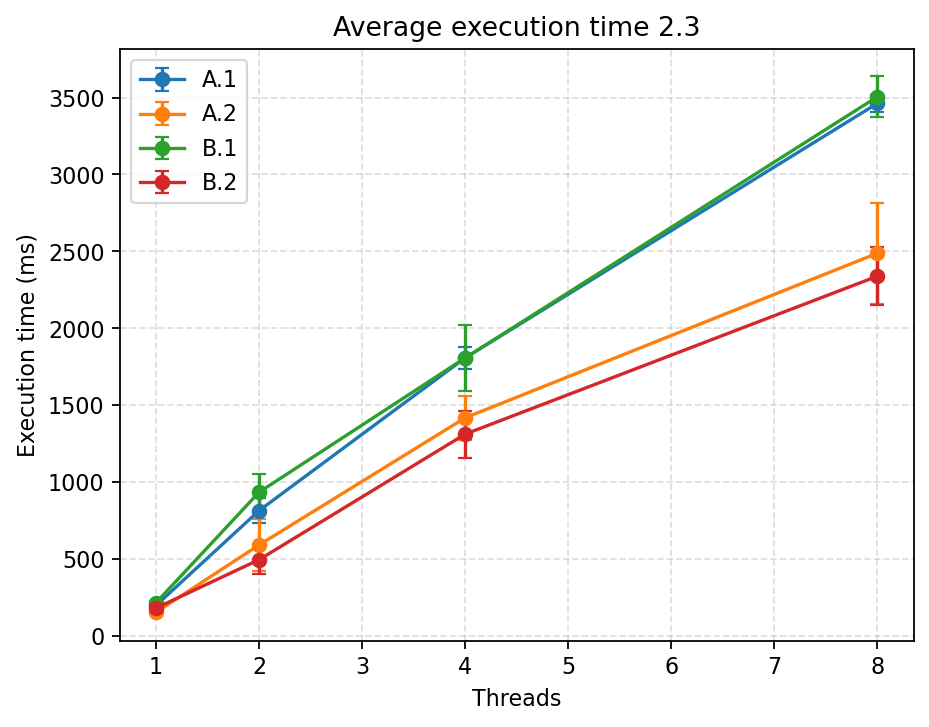

The discrepancy is always below 100, it grows as the number of threads increases.

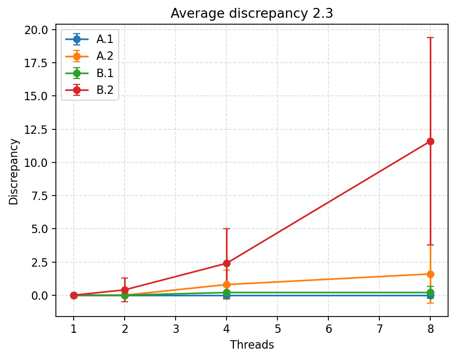
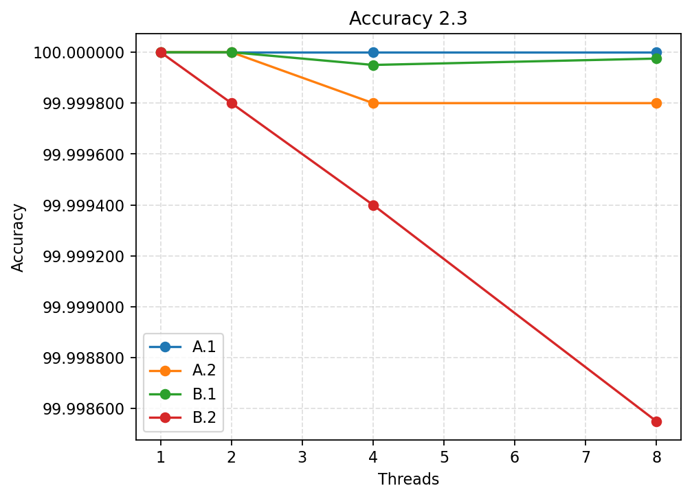

## 2.4. Lock-free time sampling with local log

Source files
- `Task4.java`

Output files
- `task2.4.out`

Replicate the experiments from Task 2.3

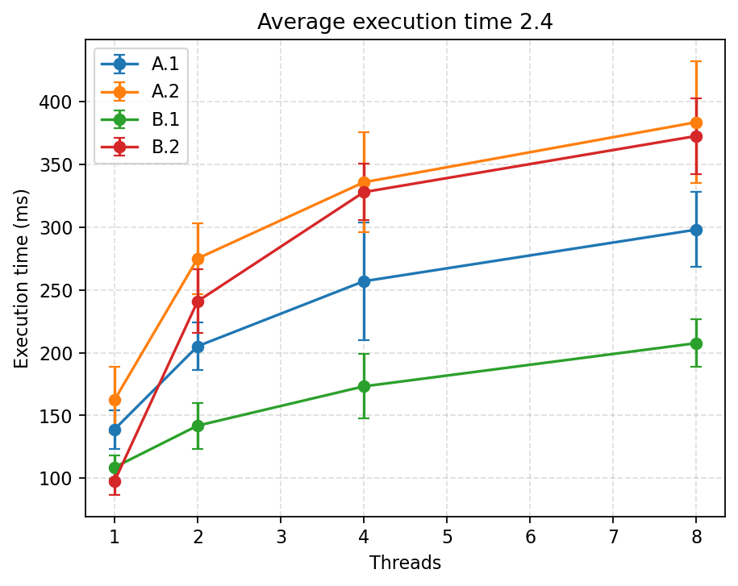
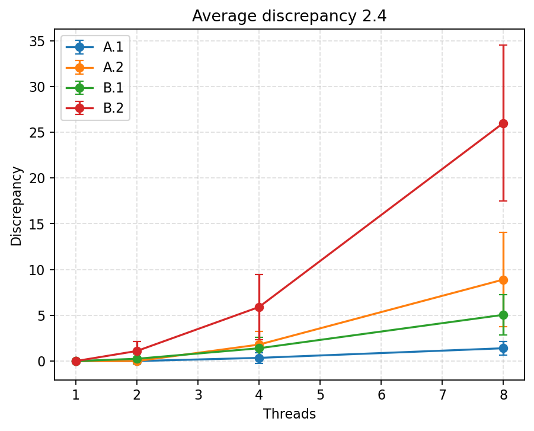
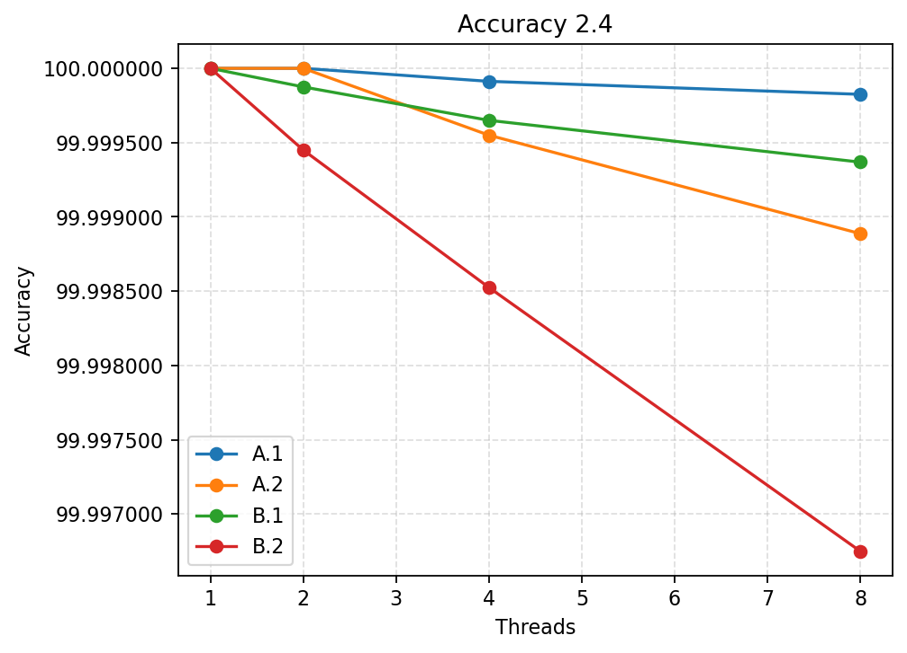

## 2.5. Lock-free time sampling with global Log

Source files
- `Task5.java`

Output files
- `task2.5.out`

Replicate the experiments from Task 2.3

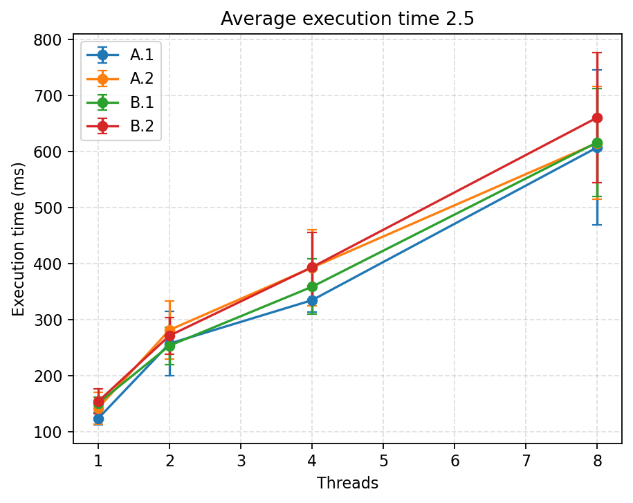
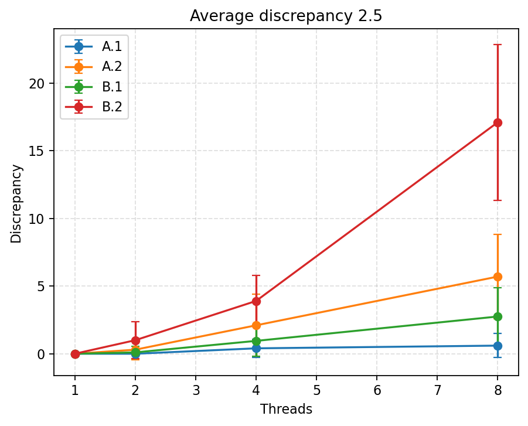
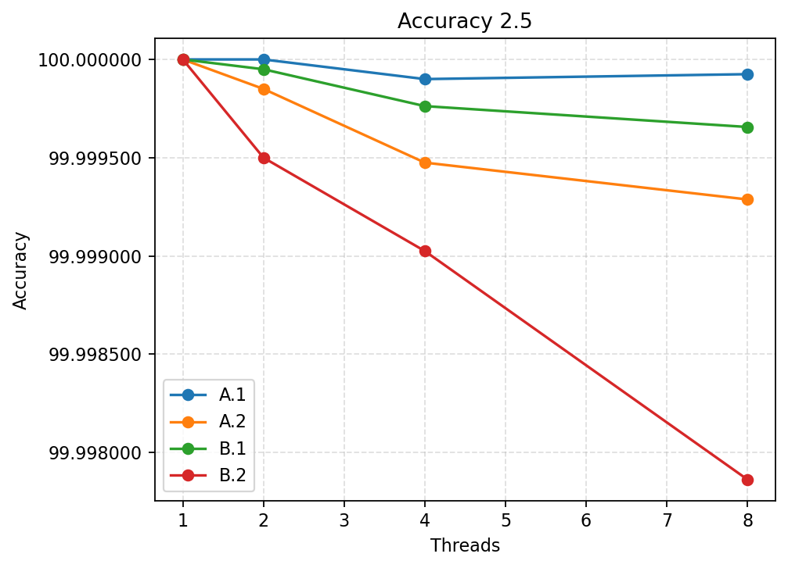


## 2.6. PDC experiments

**Lock-free time sampling with local log**

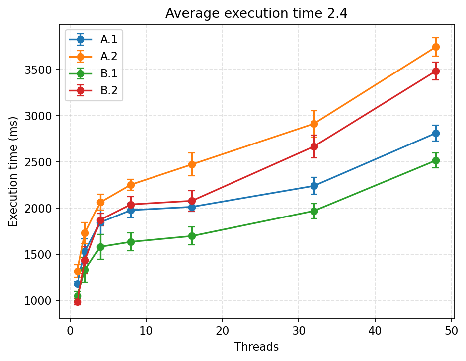
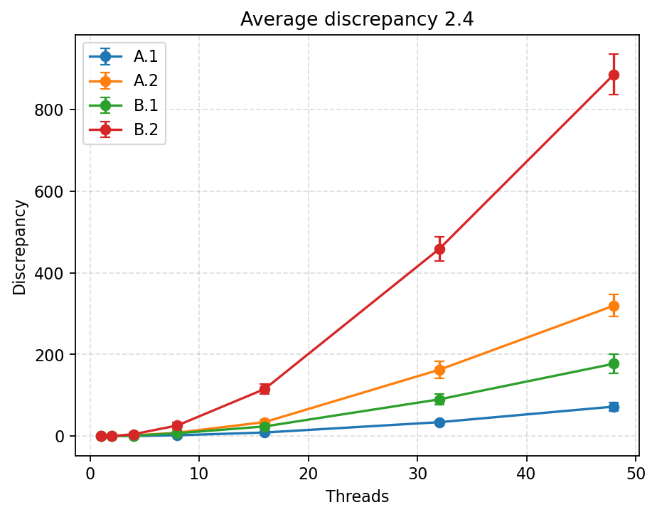
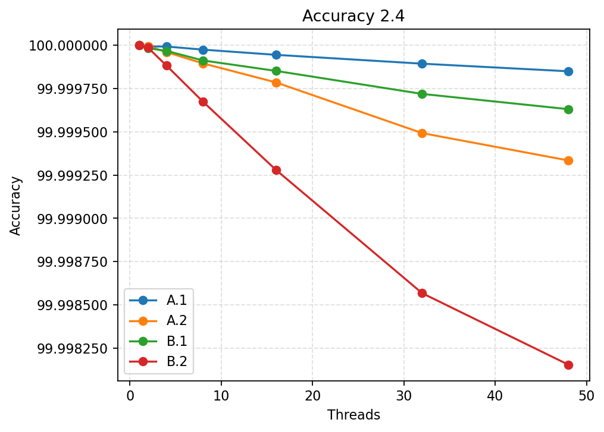

**Lock-free time sampling with global log**

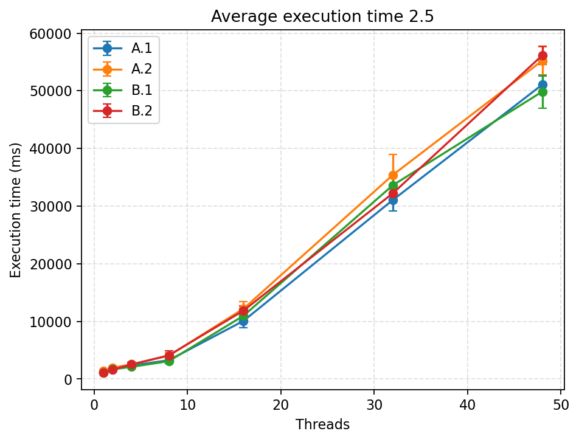
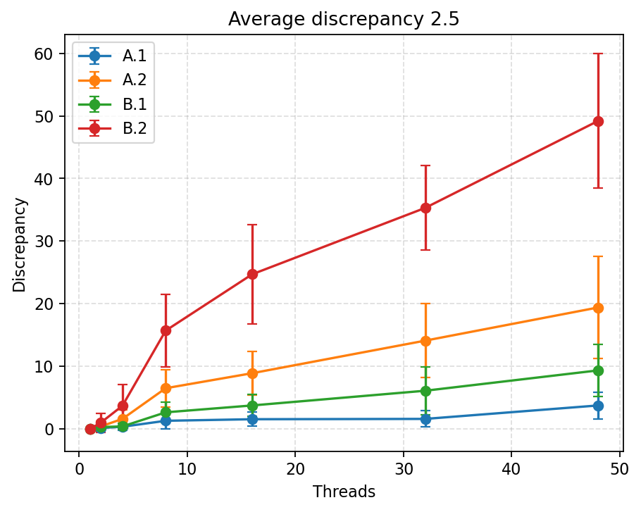
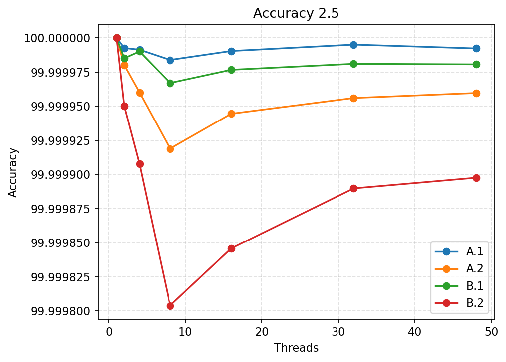
